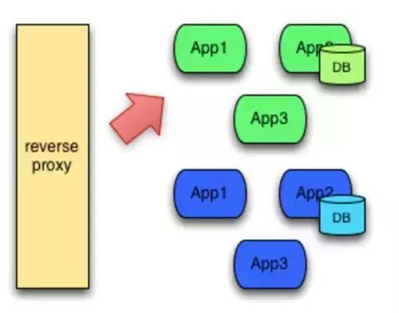
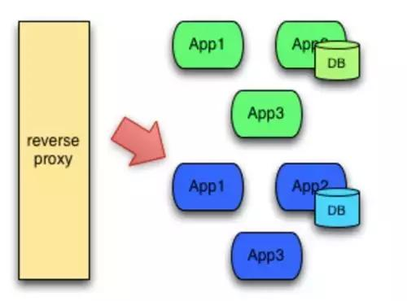

> **在项目迭代的过程中，不可避免需要”上线“。上线对应着部署，或者重新部署；部署对应着修改；修改则意味着风险。**

目前有很多用于部署的技术，有的简单，有的复杂；有的得停机，有的不需要停机即可完成部署。本文的目的就是将目前常用的布署方案做一个总结。

## 1. Blue/Green Deployment (蓝绿布署)

### 1.1. 定义

蓝绿部署是不停老版本，部署新版本然后进行测试，确认OK，将流量切到新版本，然后老版本同时也升级到新版本。

### 1.2. 特点

蓝绿部署无需停机，并且风险较小。

### 1.3. 布署过程

**第一步、** 部署版本1的应用（一开始的状态）
所有外部请求的流量都打到这个版本上。

 

**第二步、** 部署版本2的应用

版本2的代码与版本1不同(新功能、Bug修复等)。

**第三步、** 将流量从版本1切换到版本2。

 

**第四步、** 如版本2测试正常，就删除版本1正在使用的资源（例如实例），从此正式用版本2。

### 1.4. 小结

从过程不难发现，在部署的过程中，我们的应用始终在线。并且，新版本上线的过程中，并没有修改老版本的任何内容，在部署期间，老版本的状态不受影响。这样风险很小，并且，只要老版本的资源不被删除，理论上，我们可以在任何时间回滚到老版本。

### 1.5. 蓝绿发布的注意事项

当你切换到蓝色环境时，需要妥当处理未完成的业务和新的业务。如果你的数据库后端无法处理，会是一个比较麻烦的问题；

* 可能会出现需要同时处理“微服务架构应用”和“传统架构应用”的情况，如果在蓝绿部署中协调不好这两者，还是有可能会导致服务停止。
* 需要提前考虑数据库与应用部署同步迁移 /回滚的问题。
* 蓝绿部署需要有基础设施支持。
* 在非隔离基础架构（ VM 、 Docker 等）上执行蓝绿部署，蓝色环境和绿色环境有被摧毁的风险。

## 2. Rolling update（滚动发布）

### 2.1. 滚动发布定义

滚动发布：一般是取出一个或者多个服务器停止服务，执行更新，并重新将其投入使用。周而复始，直到集群中所有的实例都更新成新版本。

### 2.2. 特点

这种部署方式相对于蓝绿部署，更加节约资源——它不需要运行两个集群、两倍的实例数。我们可以部分部署，例如每次只取出集群的20%进行升级。

这种方式也有很多缺点，例如：

* 没有一个确定OK的环境。使用蓝绿部署，我们能够清晰地知道老版本是OK的，而使用滚动发布，我们无法确定。

* 修改了现有的环境。

* 如果需要回滚，很困难。举个例子，在某一次发布中，我们需要更新100个实例，每次更新10个实例，每次部署需要5分钟。当滚动发布到第80个实例时，发现了问题，需要回滚，这个回滚却是一个痛苦，并且漫长的过程。

* 有的时候，我们还可能对系统进行动态伸缩，如果部署期间，系统自动扩容/缩容了，我们还需判断到底哪个节点使用的是哪个代码。尽管有一些自动化的运维工具，但是依然令人心惊胆战。

* 因为是逐步更新，那么我们在上线代码的时候，就会短暂出现新老版本不一致的情况，如果对上线要求较高的场景，那么就需要考虑如何做好兼容的问题。

## 3. Canary Deployment (灰度发布/金丝雀部署)

### 3.1. 定义

灰度发布是指在黑与白之间，能够平滑过渡的一种发布方式。AB test就是一种灰度发布方式，让一部分用户继续用A，一部分用户开始用B，如果用户对B没有什么反对意见，那么逐步扩大范围，把所有用户都迁移到B上面来。灰度发布可以保证整体系统的稳定，在初始灰度的时候就可以发现、调整问题，以保证其影响度，而我们平常所说的金丝雀部署也就是灰度发布的一种方式。

> 注释：矿井中的金丝雀 17世纪，英国矿井工人发现，金丝雀对瓦斯这种气体十分敏感。空气中哪怕有极其微量的瓦斯，金丝雀也会停止歌唱；而当瓦斯含量超过一定限度时，虽然鲁钝的人类毫无察觉，金丝雀却早已毒发身亡。当时在采矿设备相对简陋的条件下，工人们每次下井都会带上一只金丝雀作为“瓦斯检测指标”，以便在危险状况下紧急撤离。

**灰度发布结构图如下：**

 

### 3.2. 步骤

* 准备好部署各个阶段的工件，包括：构建工件，测试脚本，配置文件和部署清单文件。

* 从负载均衡列表中移除掉“金丝雀”服务器。

* 升级“金丝雀”应用（排掉原有流量并进行部署）。

* 对应用进行自动化测试。

* 将“金丝雀”服务器重新添加到负载均衡列表中（连通性和健康检查）。

* 如果“金丝雀”在线使用测试成功，升级剩余的其他服务器。（否则就回滚）

除此之外灰度发布还可以设置路由权重，动态调整不同的权重来进行新老版本的验证。