最近在公司内部做了一次架构交流/培训，把架构的概念、架构的形式、架构设计原则都做了阐述。
[PPT观看](http://www.rowkey.me/arch-ppt/index.html)

## 什么是架构
* 部门的人力分配、项目规划
* 建筑设计中楼层规划、功能性设施规划
* 城市的道路布局、功能性建筑设计、娱乐设施设计
* 国家的城市规划、高速公路规划、高铁线路规划
>**All is 架构！！！**

## 架构的本质
* **核心生命周期**：拆分之后主体不变的子生命周期
* **非核心生命周期**：拆分之后主体改变的子生命周期
  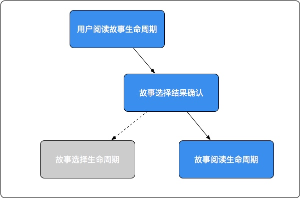 
> **架构的本质在于不断拆分生命周期（树形结构），使得业务可以做到空间上并行。拆出来的每一个生命周期都有自己的边界，不会影响到其他生命周期，各自的变化都在自己的生命周期内确定，即为高内聚。**

## 软件架构
> **软件生命周期： 软件开发生命周期 + 软件运行生命周期（软件访问、软件功能、软件监控)**

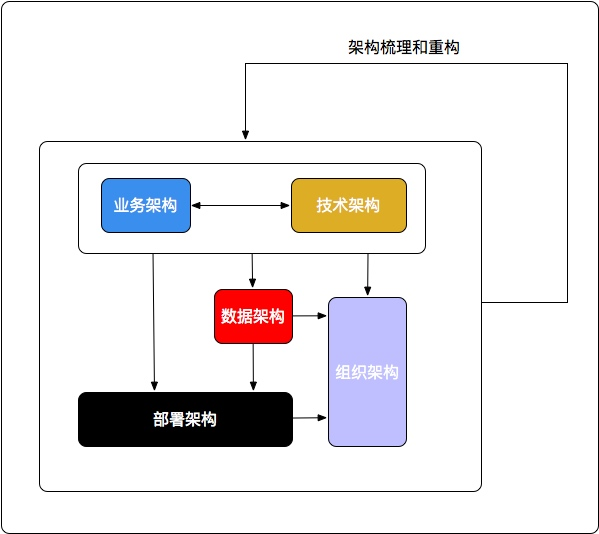 

## 优秀软件架构三要素
* **Firmness（稳定）**: Achieve a satisfactory level of freedom from damaging failure.
* **Commodity（实用）**: Utility to accomplish the tasks it is purported to be for.
* **Delight（易用）**: Pleasure in use.
> **建筑(Solid、Useful、Beautiful)->软件(Firmness、Commodity、Delight)**

## 架构流程概述
1. **业务架构**：俯视架构，包括业务规则、业务模块和业务流程。主要是对整个系统的业务进行拆分，对领域模型进行设计，把现实中的业务转化成抽象的对象。
2. **技术架构**：剖面架构，是硬件到应用的抽象，包括抽象层和编程接口。技术架构和业务架构是相辅相成的关系，业务架构的每一个部分都有其技术架构，系统的架构需要先做好这两部分。
3. **数据架构**：存储架构，主要指的是数据结构的设计。决定了应用数据源的特性，是业务架构和技术架构的基础。
4. **部署架构**：拓扑架构，包括系统部署了几个结点、结点之间的关系、服务器的高可用、容错性、网络接口与协议等。决定了应用如何运行、运行的性能、可维护性、可扩展性等，是所有架构的基础。
5. **组织架构**：团队架构，包括项目的组织形式、人员构成、职责等，是上面所有架构的保障设施。良好的组织架构能够保证其他架构的有效实施和推进。
> **架构随着业务、负载的变化需要不断的梳理和重构，推进架构的演进。**

## 业务架构
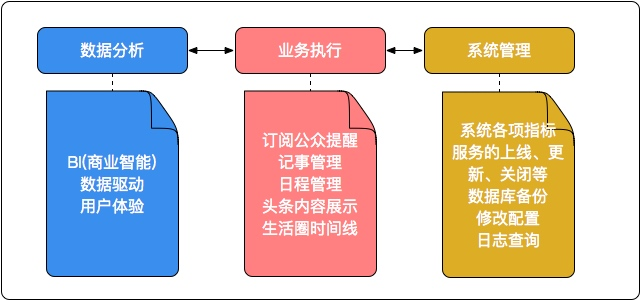 
* 业务执行是应用的核心模块，是应用的主要功能。
* 数据分析是应用的辅助模块，有助于对应用做数据驱动化研发、商业智能研究、改善用户体验。
* 系统管理是应用的基础部分，做好系统的部署、各项指标的监控、关键数据的备份等有助于应用快速迭代部署和稳定运行。

## 技术架构 - 概览
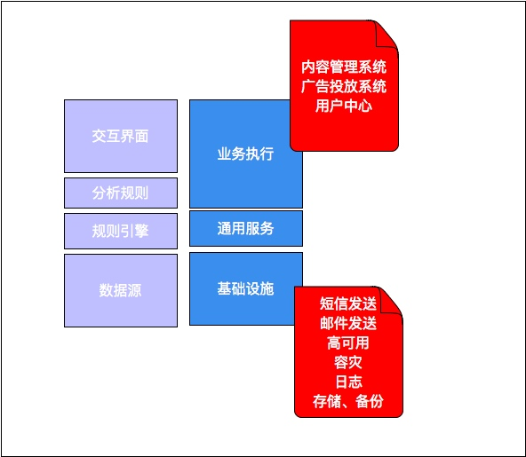 
* 业务数据源、数据的规则引擎和分析规则支撑起了交互界面的呈现
* 基础设施、通用服务构建起了底层的业务逻辑

## 技术架构 - 具体
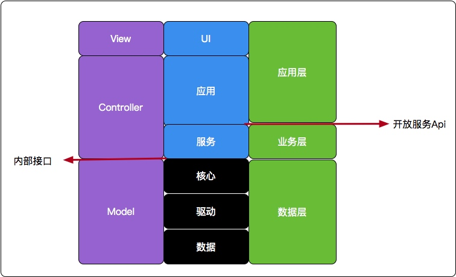 
* UI和应用都属于应用层，即提供具体的业务实现。其中UI是视图层的主要表现形式。
* 应用和服务属于控制逻辑和访问通道，其中服务则是主要的业务逻辑所在，其可以提供服务接口，供应用调用。
* 核心、驱动和数据构成了数据层，是对业务中所有相关数据的操作逻辑，是模型层。其中，核心可以对外提供接口，供服务调用。

## 架构的演化
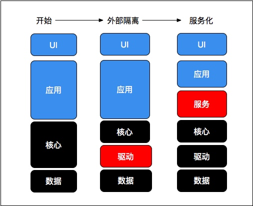 
* 单体应用架构，所有逻辑都在应用和核心模块中，包括业务逻辑、数据操作等。
* 通过数据驱动统一数据操作接口，屏蔽数据源的差异，可以根据资源进行垂直分区。
* 解耦各个模块以服务的形式对外提供api接口，形成分布式服务架构。

## 部署架构
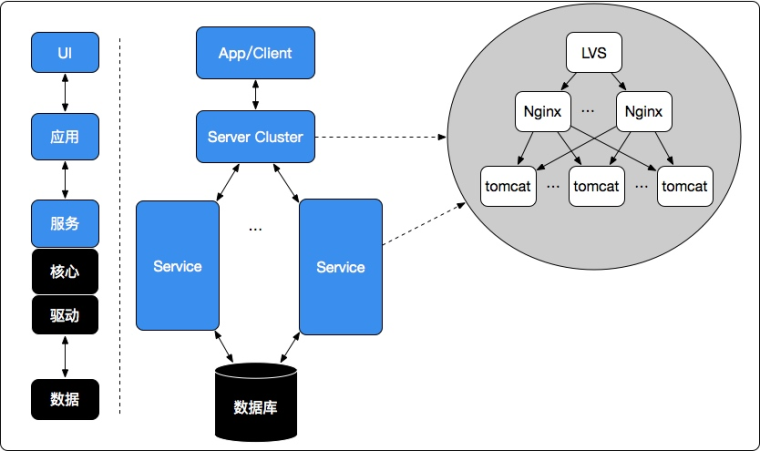 
* UI交互界面单独部署，包括web、app等形式
* 应用单独部署为一个结点或者集群
* 服务、核心以及驱动做为整体进行部署
* 数据源单独部署
* 一个简单的应用/服务集群: LVS(使用keepalived做主备) + Nginx(反向代理) + Tomcat(业务容器)

## 数据架构
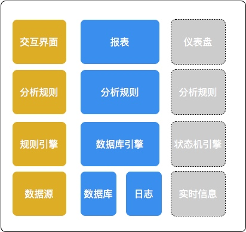 
* 交互界面呈现出来的数据交互逻辑、数据流向决定了业务的主要数据设计
* 原始的业务数据、日志和统计需要的数据支撑了数据分析需要的报表输出
* 实时信息在一定的规则和状态机引擎下可以提供出实时状态监测等仪表盘功能

## 数据的五个属性
* **访问频率**：读写频率；只读且经常被访问的数据可以冗余多份
* **对一致性的要求**：一致性要求高的数据需要严格保证准确性。
* **访问权限**：API设计中根据不同的权限暴露不同粒度的数据。PO->VO即是对同一事物在不同权限下的描述,
* **数据重要性**：不可丢失、允许部分丢失、只是缓存、无需保存
* **数据保密性**：内部可以明文、内部不可明文、可以对外公开

## 数据设计
* 充分理解交互UI，需要知道哪些数据界面关联，哪些数据可以缓存。
* 充分理解业务，要搞清楚哪些数据需要记录以及数据之间的关系。
* 数据库设计需要注意存储效率：
  - 减少事务
  - 减少联表查询
  - 适当使用索引
  - 考虑使用缓存
  - ...
* 数据统计场景中，实时性要求较高的数据统计可以用redis；非实时数据则可以使用单独表，通过队列异步运算或者定时计算更新数据。此外，对于一致性要求较高的统计数据，需要依靠事务或者定时校对机制保证准确性。

## 什么是架构师
* 生命周期识别，合理拆分生命周期
* 识别问题和问题的主体, 切忌把解决方案当问题, 发现问题永远比解决问题更加重要!!!
* 关注业务技术，保障业务增长
* OKR架构：负责关键技术的突破，解决技术可行性问题，拿出从0到1的那些关键结果
* **权责对等，保障架构执行！！！**

## 架构师必备素质
* 站的高、望的远、扎的深
* 精通某种技术，能够从本质上类比，触类旁通其他技术。
* 平等对待所有技术，只有合适与不合适，没有喜欢与不喜欢。
* 视野开阔，了解不同技术的优缺点, 知道可以直接用哪个开源项目来满足这样那样的需求，能够辨别是否需要造轮子。
* 精通设计模式，但又不泛用。
* 把系统拆分成多个子系统或模块，模块之间尽量松耦合，使得原先只能串行的开发任务，可以并行开展，可以通过投入更多人力来缩短工期。
* 能清楚地知道系统的瓶颈在什么地方，不断地定位技术难度、研发进度、性能、内存等各方面的瓶颈，不断调整骨干力量解决瓶颈，在风险爆发之前就消除隐患。
* 能够预料到需求可能产生怎样的变化，做好前瞻性设计。

## 架构六步思考法
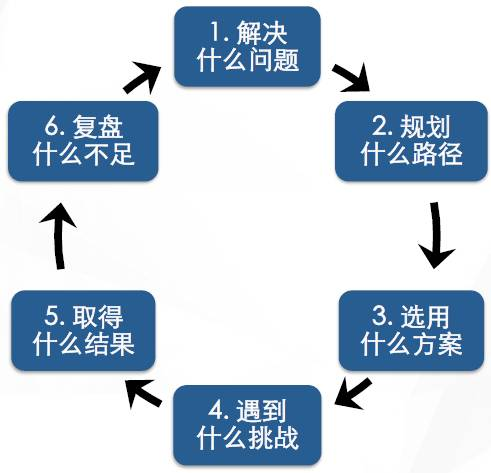 

## 架构原则 - 概览
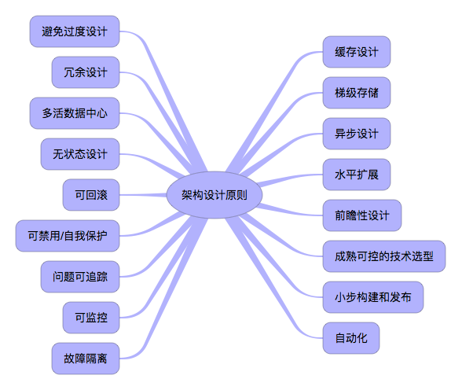 

## 架构原则
* **避免过度设计**：最简单的方案最容易实现和维护，也可以避免浪费资源。但方案中需要包括扩展。
* **冗余设计**：对服务、数据库的做结点冗余，保证服务的高可用。通过数据库主从模式、应用集群来实现。
* **多活数据中心**：为了容灾，从根本上保障应用的高可用性。需要构建多活的数据中心，以防止一个数据中心由于不可控因素出现故障后，引起整个系统的不可用。
* **无状态设计**：api、接口等的设计不能有前后依赖关系，一个资源不受其他资源改动的影响。无状态的系统才能更好地进行扩展。如果非得有状态，则要么客户端管理状态，要么服务端用分布式缓存管理状态。
* **可回滚**：对于任何业务尤其是关键业务，都具有恢复机制。可以使用基于日志的WAL、基于事件的Event sourcing等来实现可回滚。
* **可禁用/自我保护**：具有限流机制，当上游的流量超过自身的负载能力时，能够拒绝溢出的请求。可以通过手动开关或者自动开关（监测异常流量行为），在应用前端挡住流量。
* **问题可追踪**：当系统出现问题时，能够定位请求的轨迹、每一步的请求信息等。分布式链路追踪系统即解决的此方面的问题。
* **可监控**：可监控是保障系统能够稳定运行的关键。包括对业务逻辑的监控、应用进程的监控以及应用依赖的CPU、硬盘等系统资源的监控。每一个系统都需要做好这几个层面的监控。
* **故障隔离**：将系统依赖的资源(线程、CPU)和服务隔离开来能够使得某个服务的故障不会影响其他服务的调用。通过线程池或者分散部署结点可以对故障进行隔离。
* **成熟可控的技术选型**：使用市面上主流、成熟、文档、支持资源多的技术，选择合适的而非最火的技术实现系统。
* **梯级存储**：内存->SSD硬盘->传统硬盘->磁带，可以根据数据的重要性和生命周期对数据进行分级存储。
* **缓存设计**：隔离请求与后端逻辑、存储，是就近原则的一种机制。包括客户端缓存（预先下发资源）、nginx缓存、本地缓存以及分布式缓存。
* **异步设计**：对于调用方不关注结果或者允许结果延时返回的接口，采用队列进行异步响应能够很大程度提高系统性能；调用其他服务的时候不去等待服务方返回结果直接返回，同样能够提升系统响应性能。异步队列也是解决分布式事务的常用手段。
* **前瞻性设计**：根据行业经验和预判，提前把可扩展性、后向兼容性设计好。
* **水平扩展**：相比起垂直扩展，能够通过堆机器解决问题是最优先考虑的问题，系统的负载能力也才能接近无限扩展。此外，基于`云计算`技术根据系统的负载自动调整容量能够在节省成本的同时保证服务的可用性。
* **小步构建和发布**：快速迭代项目，快速试错。不能有跨度时间过长的项目规划。
* **自动化**：打包、测试的自动化称为持续集成，部署的自动化称为持续部署。自动化机制是快速迭代和试错的基础保证。

## 架构原则 - 可扩展
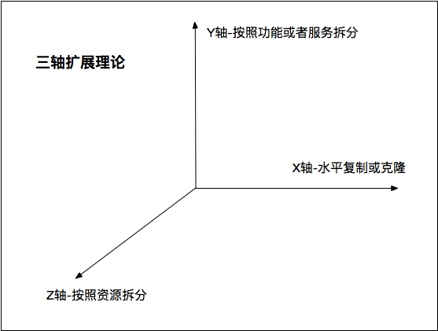 
* X轴，水平复制或克隆，面向目标，如数据库读写分离、复制表、replication等，将单体应用或者以来的服务做冗余，通过负载均衡提高系统负载能力。
* Y轴，面向功能/服务，如垂直应用、分布式服务等，就是将单体应用根据功能拆分成小的应用或者服务。
* Z轴，面向资源，如数据库水平分库，对资源做分片，将压力分散到不同的结点上。
> * **避免依赖于数据库的运算功能(函数、存储器、触发器等)，将负载放在更容易扩展的业务应用端。**
> * **可扩展方案原则： 20倍设计、3倍实施、1.5倍部署（DID）。**

## 系统响应性能提升五板斧
* **异步**：队列缓冲、异步请求。
* **并发**：利用多CPU多线程执行业务逻辑。
* **就近原则**：缓存、梯度存储。
* **减少IO**：合并细粒度接口为粗粒度接口、频繁的覆盖操作可以只做最后一次操作。这里一个需要特别注意的地方: **代码中尽量避免在循环中调用外部服务，更好的做法是使用粗粒度批量接口在循环外面只进行一次请求。**
* **分区**：频繁访问的数据集规模保持在合理的范围。

## 参考资料
* 《架构真经》 by 陈斌
* 《聊聊架构》 by 王概凯
* 《架构师的第一课》 by 蔡学镛
* 架构六步思考法 by 夏华夏@美团

---
> 来源: http://www.rowkey.me/arch-ppt/index.html