今天分享的内容有四个方面：

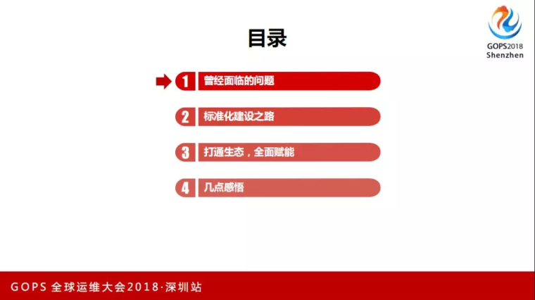 

## 曾经面临的问题

唯品会的体量属于居中的互联网公司，希望我们的实践能给相似体量的互联网同仁一些借鉴。

唯品会的业务逻辑是比较庞大的，除了电商，还有物流、金融，在前期的快速发展阶段，技术栈是先快速上线，各种各样的技术架构都有，到后期，金融外购软件的引入也有不太规范的东西。

不同人员面对不同的业务线，由于业务线的不统一，导致业务运维的盲区非常多，难以实现人力共享。

我们建设了非常多平台，发布、变更等等都有，但是总觉得做事情的时候差一口气，没有办法形成非常大的力量支持业务人员，是散兵作战的状态。因为技术栈的不统一，做平台建设的时候要考虑各种特殊场景，甚至妥协。

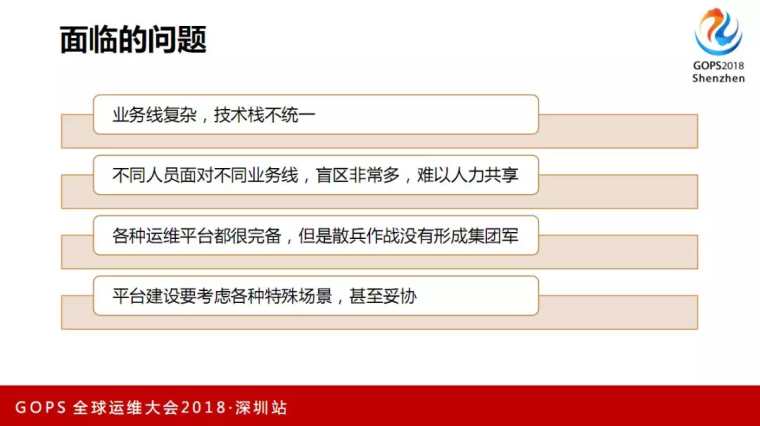 

于是我们开始反思：
* 第一，技术人如何确保`质量`、`成本`、`效率`三者的平衡？下图是非常关键的问题。这些之间，没有人敢说都做得非常完美，在这三者之间找最好的平衡点。
* 第二，建设了这么多的工具平台，运维人员为什么依然疲惫不堪？
* 第三，运维平台建设蒙面狂奔时如何不忘初心？

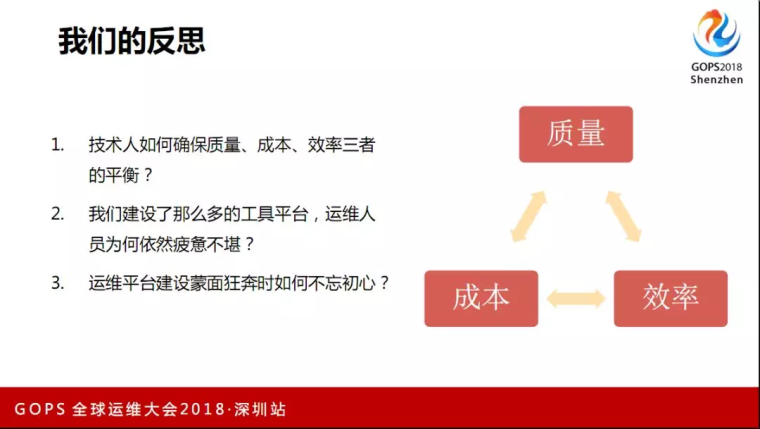 
对此我们总结了四个经验：
* 第一，平台建设者必须深刻理解运维痛点。
* 第二，平台建设的技术选型不是最重要的，真正理解运维才是最关键。不是说技术选型不重要，不是最重要的。
* 第三，标准化程度决定了运维自动化的上限。
* 第四，自动化的水平决定了运维新的增长点。总结一句话就是标准化迫在眉睫。

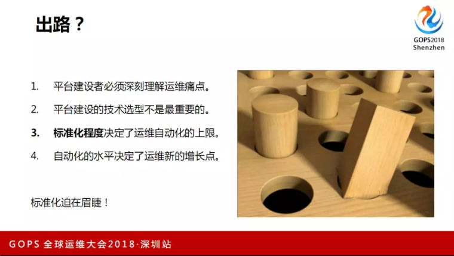 

## 标准化建设之路

###  组件概念 

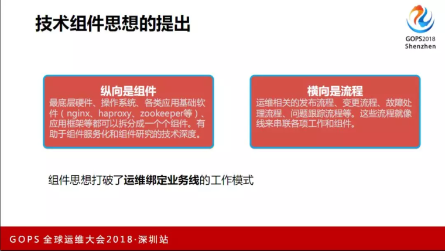 

组件思想奠定了标准化基础：
* 技术成长方面，我们的做法是组件专家组负责，专家组明确组件的发展方向，探索最佳实践，有利于技术积累和人员的技能成长。
* 组建服务化，运维人员对外转型技术输出，提供服务化的产品，开发仅按照标准API使用，无需关注底层细节。
* 消除业务壁垒，业务人员有了新的追求。

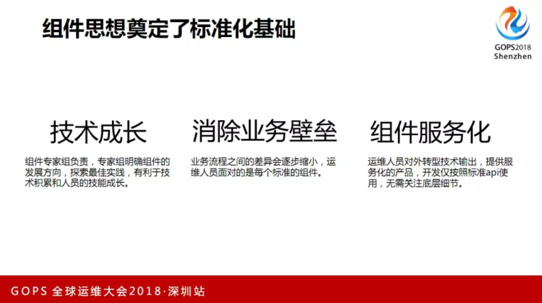 

### 标准化建设蓝图

这是标准化建设的大蓝图，运维标准化是非常大的项目，我们拆分了十几个小的项目。
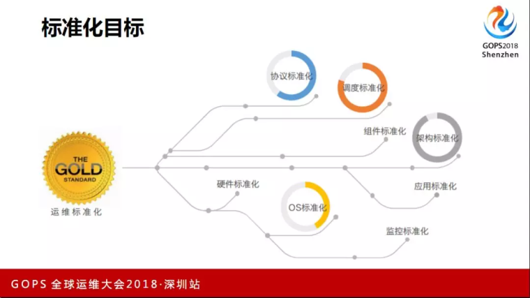 

这是结合唯品会的业务特点，根据公司的具体业务情况进行了具体的拆分。左边是技术流程栈，右边是我们得出的产出。红色是跟业务特性相关的，红色以下的是跟运维相关的。

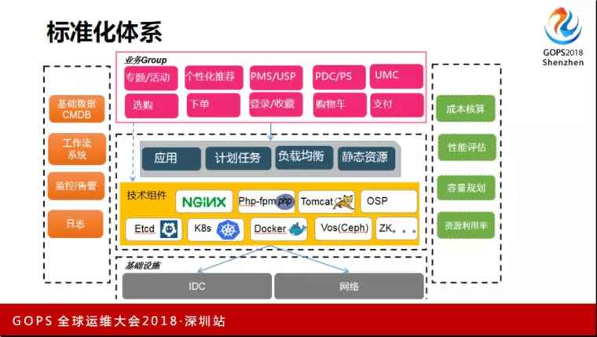 

### 配置库管理

开发提一个需求，让运维改生产上的某个配置，这非常痛苦。开发有没有权限改？还是运维去做，运维又不懂，开发又觉得你是小白，懒得跟你解释，运维没有精力学习成百上千的业务系统。

解决思路是分层治理，专业的人做专业的事情。

比如，某一购物车的参数改动之后影响到业务逻辑相关的，这样的事情就交给开发去做，跟组件相关的事情，专家组做这部分工作。

他们去做，不可能开发人员直接到线上去改某个路径下的某个文件，于是就建设了Janitors平台，把各种配置文件有一个标准的梳理，赋予开发人员一个权限，管理自己业务系统的参数就可以了，可以及时改参数，及时生效。

运维人员关注下面哪一层，基于Puppet来做运维管理。

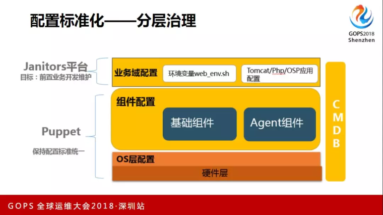 

### 监控标准化

当机器超过1万的时候，zabbix是不堪重负的，唯品会最初是有多套zabbix做监控。

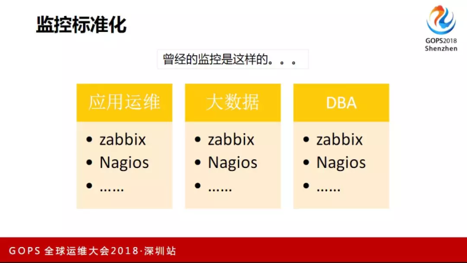 

理想的监控：
* 统一、快、精准
* 有统一的入口
* 自动化、监控插件标准化
* 不能有人员干预我去部监控、加监控
* 监控插件标准化。每个人眼中都有监控标准，最终做下来是有多个监控指标，比较致命。
* 监控视图定制，充分发挥数据价值，这是偏向运维的。把线上的运行指标的数据，充分发挥其价值，要看到哪些系统赚钱，用的资源又最少，哪些系统是狂花钱，用的资源又最多。
* 为开发赋能、系统可扩展。

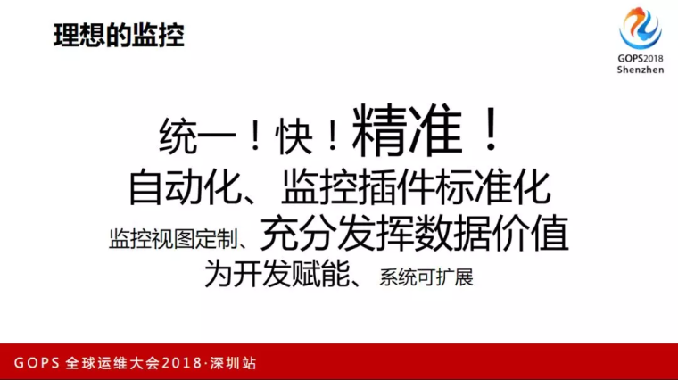 

以上这些，zabbix都不满足。

监控标准化目标拆分：
* 第一层是事件来源，即CMDB应用信息标准化
* 第二层是监控模块标准化，专家组负责技术组件的监控设计、阈值设置，监控模版统一的版本控制。
* 第三层是告警规则标准化。监控系统与告警系统分离，各司其责。告警根据设备等级、应用等级、严重等级区分。

告警发送对象统一来源是CMDB。

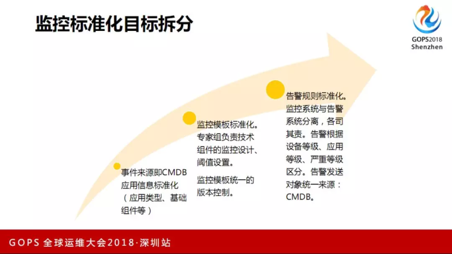 

我们做了自己的产品是VIPFalcon，是基于openfalcon的二次开发，现在的监控节点是25000左右，有500万多的metric，通过数据流计算，重新聚合开发数据。这些数据通过Hive来落地进行数据分析，把数据价值发挥出来。

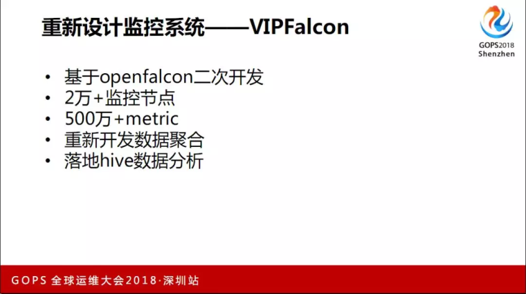 

通过监控标准化后，VIPFalcon和Zabbix的对比，从一个地方能看到整个公司所有的基础监控的信息，不需要多个入口。采集扩展方面，VIPFalcon是基于Plugin方式，面向HostGroup维度，通过Git进行维护。管理方面，和运维生态、编程语言方面，VIPFalcon都超出Zabbix一大截。

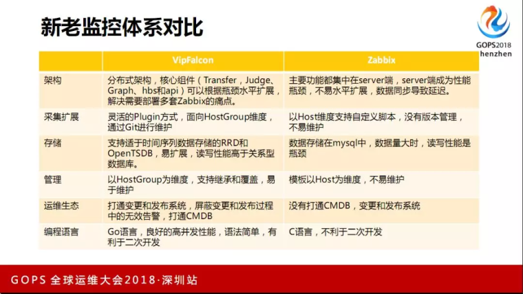 

通过这样工作的效果，我们对内实现了质量提升，大家的工作效率得到提升，维护成本下降，提升用户体验、控制了风险。

对外价值输出，打通运维体系，为开发赋能，站在开发的角度帮他们思考资源使用的问题。

精细运维、运营，业务成本核算是数据价值方面的一个产出。

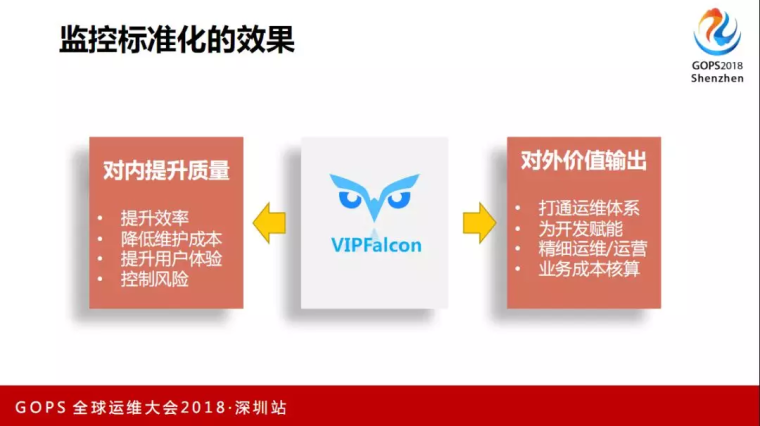 

### 变更标准化

变更跟所有运维人员是紧密相关的，运维背的所有锅都跟这方面有关系。关键是两个思路：
* 首先提出了风险矩阵。我们做了一个SDK，这个矩阵用一句话形容就是把原有的变更风险从对象和技术风险两个维度进行了拆分。我简单说一下，对象是指对一个业务系统，它可能是核心系统，也可能是重要系统，也可能是不重要的系统，可以给它画像，会有一个打分。这两者结合在一起，对的变更有一个精准的打分。
* 标准变更模版库是指变更通过每个组建的专家设计关于组件所有的变更模版设置，基于专家的模版做的变更，不可以天马行空地想变更的方案。

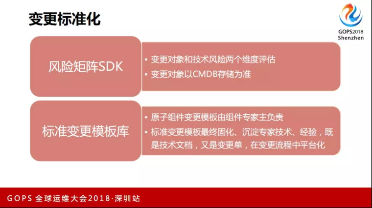 

这些工作固化下来后，我们把各种各样的变更固化成一个个的APP，在变更平台上输出参数可以一键式进行变更。

## 打通生态，全面赋能

什么叫生态？我们建设了这么多自动化系统，每个系统都需要人执行一些任务的话，比如做变更还需要人点击一些按钮，这是还处于自动化的初期。想建设的生态是希望系统驱动系统，所有的系统之间是通过接口调用的方式，人在这个过程中尽量少地参与。

### CMDB代替流程

打通运维生态，原来的方式是以流程为核心的，大多数人对流程都是非常反感的，没有人真的喜欢流程这个东西。后来，我们转变为以运维流程 + CMDB为核心的方式去实现。流程是非常教条的东西，打个比方，流程告诉我今天下午三点可以做A变更，是不是真的可以做呢？他没有权衡场景、对象、时间的因素，如果下午三点对象有问题，这个流程不应该走下去，但是流程比较傻瓜式地告诉你可以走下去。

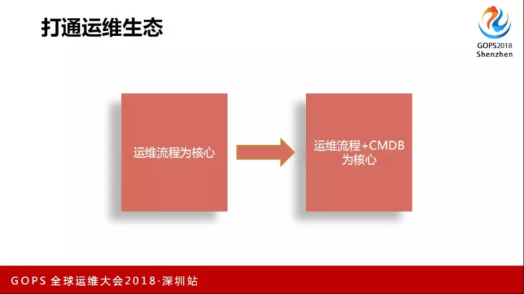 

这是唯品会的具体业务，中间是流程管控和以CMDB为核心，自上而下是跟运维相关的落地。从组件到部署标准，到各种各样的自助平台。流程打通之后，监控可以发出来，希望通过监控驱动来自愈。比方，磁盘告警到了90%有一个告警，调用自动化的平台上一个磁盘清理的APP，由它去执行。清理完之后，再告诉监控系统给我发一个短信：发现了90%的告警，也执行完告警。这是比较理想的工作状态，这一点已经实现了。

 

### 变更打通的思路

关于生态打通方面，一开始的思路是比较宏大的，原来想的是设计一个完美的流程，把事情完全打通，后面发现想得太天真，很难有多么完美的方案能把运维相关的工具体系打通，我们的思路还是一个一个地去打通。比如ABCD系统之间的打通，先打通AB，然后打通CD。变更上的几个问题都是大家一直会碰到的（见PPT），建设了非常好的自动化变更的系统，也非常灵活，但是这是一把双刃剑，DevOps变更失控，变更流程不遵守。

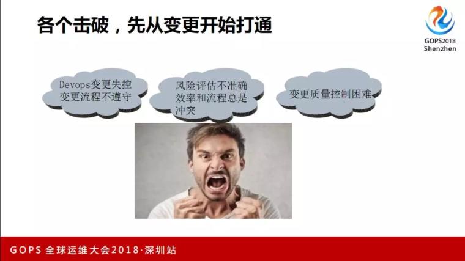 
变更打通设计思路：
* 第一，流程系统提供SDK给各自动化工具，提供变更的管控能力、变更的收集能力和SDK的自治能力；
* 第二，自动化能力平台，梳理变更风险矩阵集成SDK，上报变更风险矩阵；
* 第三，流程系统提供SDK给各自动化工具，提供变更的管控能力、变更的收集能力和SDK的自治能力。

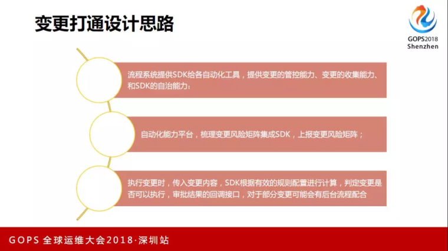 

这是我们的一个体系（见下图），中间是有一个标准模版库，技术专家组设计了一套标准变更，SDK跟左边之间的关联是从负载均衡管理平台、定时任务管理平台、云平台、运维平台以及其他的，打通这些平台给开发人员赋能。

开发想做简单的业务线上的配置，原来的做法是开发人员要找运维说要做这个配置，运维说等一下，要提一个变更流程，流程走起来之后，发现老板又不在，要找老板审批，这个流程如果顺利的话要大半天。

现在是开发在tools平台上提交一个申请，中央管控认为风险非常低就可以直接做了，开发一件事情就做完了。

这个事情带来的收益就是固化标准变更、简化流程、有效控制变更风险，给开发赋能。

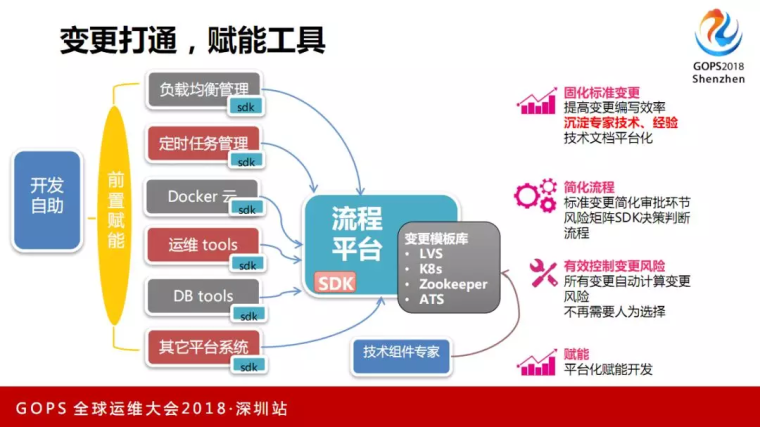 

### 监控打通实现自动化

我们的思路是整个服务器的生态，从初始化、部署、运行、暂停到服务下线，所有事情都不需要人工干预监控的设置，所有的入口都是监控系统和CMDB之间打通的。所有信息来源只有一个，就是CMDB。当CMDB探测到某个信息有变化，它会写一个消息队列，监控系统就去消费这个消息队列，然后执行相应的监控的挂载或下线的流程。

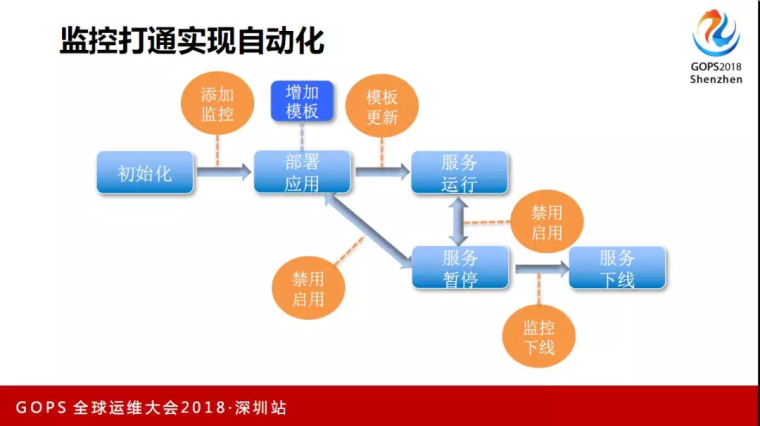 

这是具体的实现（见下图），中间还是监控系统，左边是告警和数据聚合。

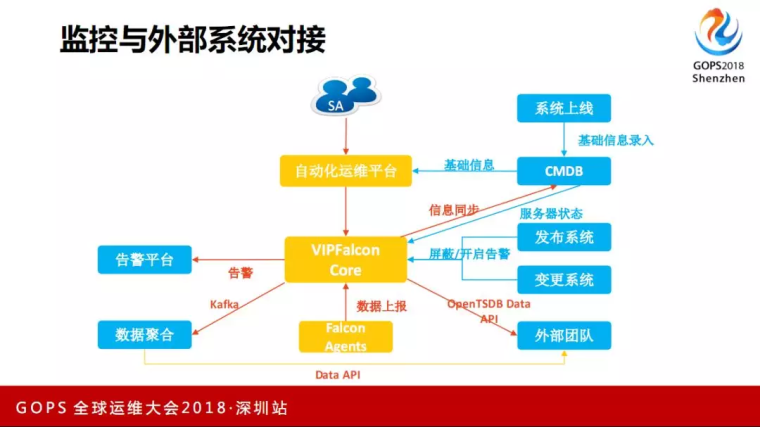 

通过前面的标准化和生态打通之后，收益有两点：
* 第一，运维终于有了全面、集中的数据，包括监控数据拿到了，所有线上变更的数据已经有了，线上运行的数据都会有统一的池子沉淀下来。这样的好处是什么呢？如果去做AIOps，没有数据一切都是空谈，通过这种生态的打通，把数据沉淀到一个地方，为后续做智能运维埋下伏笔。
* 第二，通过这些事情，实现了效率和流程的平衡，既保证了效率，在风险上又有相应的把控。

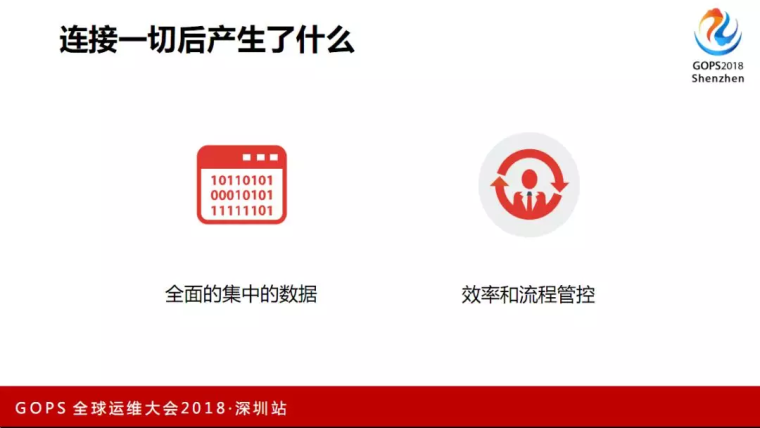 

### 再回首

回到刚开始提出的三个问题，质量、效率和成本方面都有明显的收益。

* 质量方面，从原来的苦力转型变成了平台建设者，从自动化迈出第一步到智能化。
* 效率方面，降低门槛、效率提升、流程管控。
* 成本方面，我们通过数据的聚合后，对每个应用进行画像，对资源的利用更有了数据的支撑。

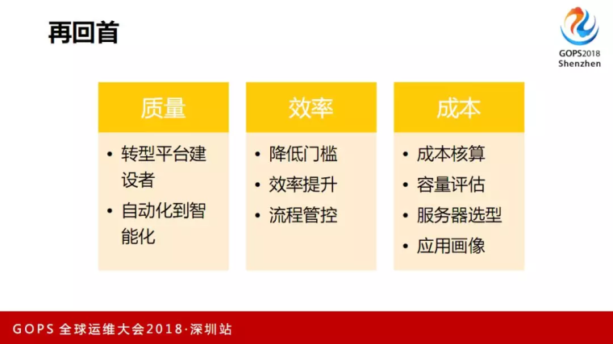 

## 几点感悟
* **有了标准化的土壤，自动化、智能化才能生根发芽。**
* **标准化需要强有力的领导、明确的方法论。**
* **DevOps 建设要有业务视角，不是为了技术而做技术，而是从成本、质量、效率三个方面去建设，平台建设的格局要高一点。**
* **单一兵种需要整合成集团军才能发挥战斗力，在鄙视链里再往上提一步就是靠整合的能力了。**